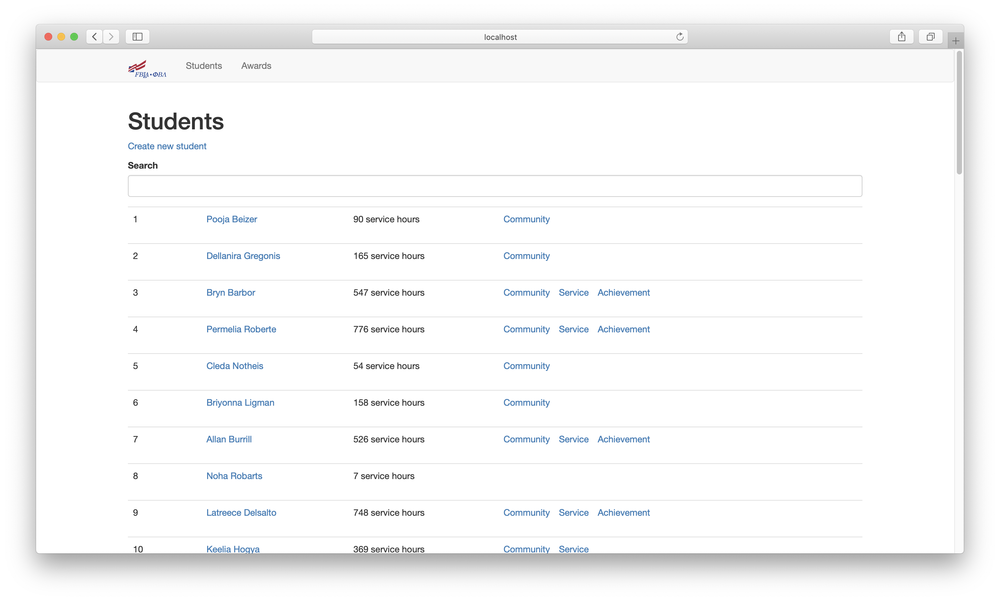

# FBLA CSA

## Installation

Installation is pretty simple. Clone the repo, then install python dependencies with pip:

```pip install -r requirements.txt```

Install [wkhtmltopdf](https://github.com/JazzCore/python-pdfkit/wiki/Installing-wkhtmltopdf) for report generation

### Configuration

The following vars need to be put in a config.py file inside an instance dir in the root of the repo dir.

 - ADMIN_PASS: The password required for admin login.

 - SENTRY_DSN: A DSN for Sentry. If provided, Sentry error reporting is setup.

An example would look like this

```python
# The password required for admin login.
ADMIN_PASS = 'password'

# A DSN for sentry. If provided, sentry error reporting is set up.
SENTRY_DSN = None
```

### Database

After setting up the FLASK_APP, you can initialize the database:

```shell script
flask init
```

Then, populate the database:

```shell script
flask populate
```

This will insert the CSA award categories and randomly generate students to fill the database

## Website



Once the server is up and running, this is what users see. I hope it's pretty clear on how to use!

